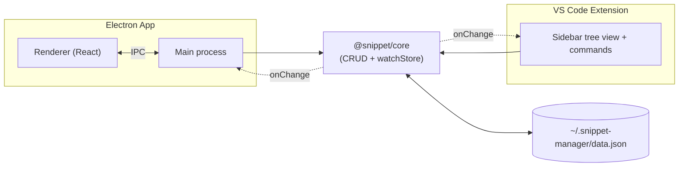

# Snippet Manager

Code snippet manager as an npm workspaces monorepo: a shared core library, a VS Code
extension, and an Electron desktop app. Both apps read/write the same local JSON store
and stay in sync live via file watching — no server, no accounts.

## Structure

```
packages/
  core/               @snippet/core - storage, CRUD, file watching. No UI.
  vscode-extension/   Sidebar tree view + commands.
  electron-app/       Two-pane desktop app (React + Vite + Electron).
  installer/          Custom-branded Windows installer/uninstaller for electron-app.
```

Both apps depend on `@snippet/core` as a workspace package and never touch the
filesystem directly — all reads/writes go through `packages/core`.

## Architecture



Both front ends only ever call into `@snippet/core`. The core module is the only thing
that touches `data.json`, and `watchStore()` (backed by chokidar) is what pushes changes
back out to whichever app didn't make them — that's the entire sync mechanism, no
polling, no server.

## How the sync works

Snippets live in a single `data.json` in the OS's standard app-data directory (e.g.
`%APPDATA%\snippet-manager` on Windows, `~/Library/Application Support/snippet-manager`
on macOS) — see `packages/core/src/store.ts`. `watchStore()` uses chokidar to watch that
file and calls back with the fresh snippet list whenever it changes. Both the VS Code
extension and the Electron app's main process subscribe to it on startup, so editing a
snippet in one app updates the other without a reload.

The store location can be relocated (Electron app → Settings → Data location). That
writes a small pointer file at the default location recording the chosen folder; every
process — including ones already running — resolves the same path from it, so relocating
never breaks the sync.

The Electron renderer never imports `@snippet/core` directly — the main process owns
the store and exposes it to the renderer over IPC (see `packages/electron-app/electron`).

## Setup

```bash
npm install
```

Installs dependencies for all three packages via npm workspaces.

## Development

### core

```bash
cd packages/core
npm run build   # tsc -> dist/
npm test        # CRUD smoke test against the real store (backs it up first)
```

### vscode-extension

```bash
cd packages/vscode-extension
npm run compile
```

Then launch the Extension Development Host from VS Code (F5), or from the command line:

```bash
code --extensionDevelopmentPath="$(pwd)"
```

Sidebar groups snippets by language, with a "Pinned" group at the top for anything
pinned. Clicking a snippet copies/inserts/opens it depending on the
`snippetManager.clickAction` setting. Snippets marked "hidden from VS Code" in the
Electron app (see below) are filtered out of the tree and search.

### electron-app

```bash
cd packages/electron-app
npm run dev
```

Two-pane layout: language/category/tag filters on the left, snippet list + code detail
view on the right. Header controls:

- **Theme** — light / dark / system, defaults to the OS theme on first launch, persisted
  after that via `electron-store`.
- **Language** — EN / TH, defaults to the OS locale on first launch, persisted after an
  explicit change.
- **Settings** — data location (view/change/reset the folder `data.json` lives in) and
  backup & restore (export all snippets or one snippet to a `.json` file; import merges
  with or replaces the existing store).

Per-snippet: a **"Hide from VS Code extension"** toggle for snippets you don't want
cluttering the sidebar, and an **export** button on the detail view.

## Packaging & updates

Two separate installers get built and published to GitHub Releases on a `v*` tag push
(`.github/workflows/release.yml`):

- **`packages/installer`** — a small custom-branded Electron app (iOS 26 look, matching
  the main app) that end users actually download and run. It bundles a prebuilt copy of
  `electron-app` (see `scripts/prepare-payload.mjs`), copies it to
  `%LOCALAPPDATA%\Programs\Snippet Manager` (customizable), creates Start Menu/Desktop
  shortcuts, and registers a normal Windows "Apps & Features" uninstall entry. Packaged
  via `electron-builder` with the `portable` Windows target — a single self-contained
  `.exe`, no NSIS UI involved.
- **`packages/electron-app`**'s own `electron-builder` config (`nsis-web` target) is kept
  only so `electron-updater` has something to silently update to in the background — end
  users never interact with this installer directly.

The packaged app checks GitHub Releases for updates on launch via `electron-updater`
(`packages/electron-app/electron/updater.ts`) and shows a banner to download and, once
ready, restart & install — this only runs in packaged builds, not `npm run dev`.

## License

MIT — see [LICENSE](LICENSE).
